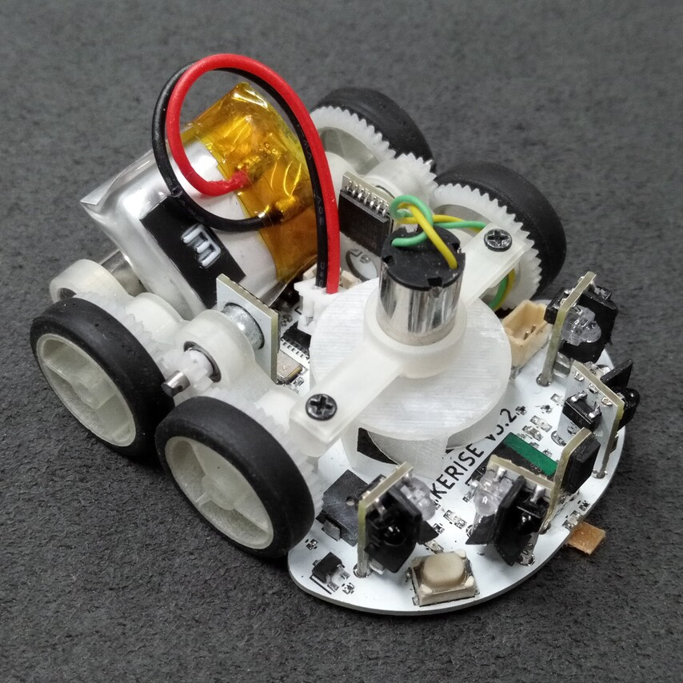

# MicroMouse KERISE v3

ハーフサイズマイクロマウス

## 戦績

- 第38回全日本マイクロマウス大会2017
  - ハーフサイズ競技エキスパートクラス予選13位
  - ハーフサイズ競技エキスパートクラス決勝13位
  - ハーフサイズ競技エキスパートクラス特別賞

## スペック

| 部品             | 型番        | 備考                              |
| :--------------- | :---------- | :-------------------------------- |
| モーター         | 不明        | 直径6mm 長さ10mm コアレスモーター |
| エンコーダ       | AS5048A     | 4096パルス 磁気式                 |
| マイコン         | ESP32-D0WD  | 240MHz dual core                  |
| 赤外線LED        | VSMB294008G | 波長940mm                         |
| フォトダイオード | VEMD2020X01 | 波長940nm                         |
| モータードライバ | DRV8835     | 最大電流1.5A x 2ch                |
| 6軸センサ        | ICM-20602   | 3軸ジャイロ+3軸加速度             |
| バッテリー       | 不明        | 3.7V 25C 100mAh 1S                |

## 回路設計

- KiCad

## 開発環境

- ESP-IDF
